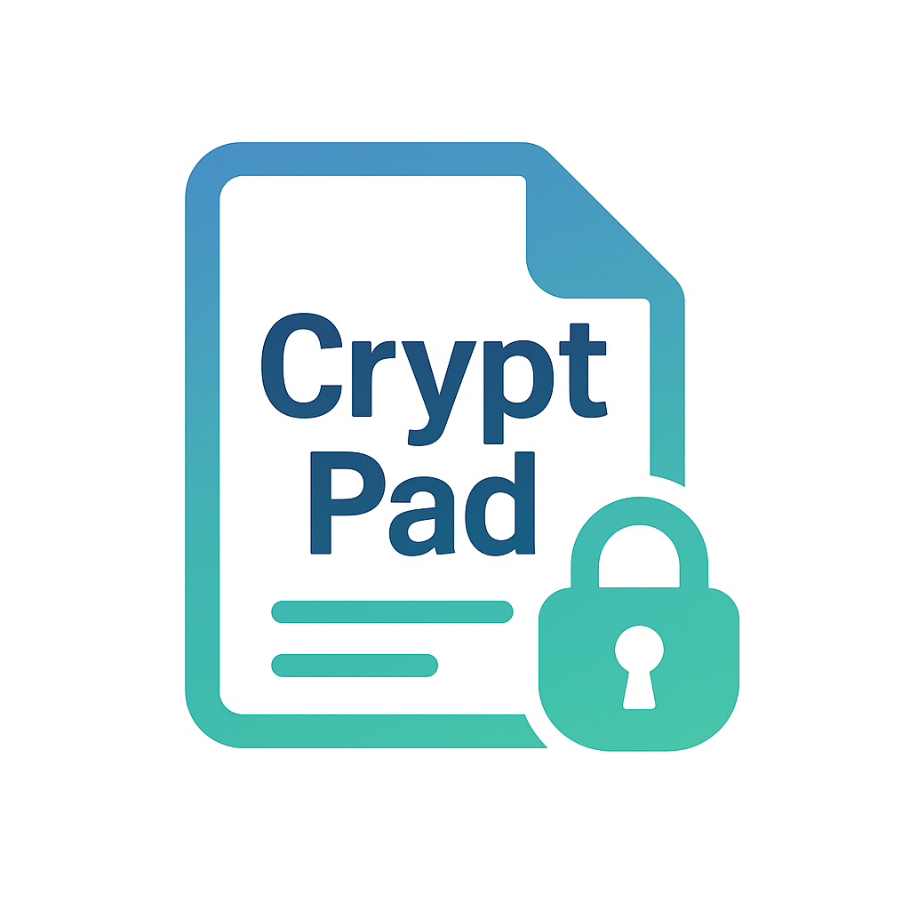

<div align="center">
  
  
  # CryptPad - Simple Encrypted Text Editor
  
  **Secure, flexible text editing with client-side encryption**
</div>

---

This is a simple web-based text editor that allows users to create pages, write text, and encrypt/decrypt portions of the text using a symmetric key. The application offers flexible security modes for key storage ranging from convenient local storage to high-security no-storage options.

## Features

### Core Functionality
- Create new pages with unique 4-letter IDs (e.g., `http://yourdomain/abcd`)
- Simple text editing in a textarea with real-time saving
- **Selective Text Encryption**: Encrypt only the parts of your text that need protection
- **Visual Encryption Labels**: Encrypted content appears as `[LOCKED_CONTENT_#ID]` labels for easy identification
- **Smart Decryption**: Click decrypt to reveal content at cursor position
- **Copy with Auto-Decrypt**: Copy text and automatically decrypt any encrypted portions

### Security Modes
Each page can be configured with one of two security levels:

- **🟢 Local Storage**: Encryption key stored permanently in browser localStorage (convenient for frequent use)
- **🔴 No Key Storage** *(Default)*: Highest security - no key storage anywhere on computer, key cleared on page reload

### User Experience Improvements
- **Non-intrusive Toast Notifications**: No more clicking "OK" on popup messages - notifications auto-dismiss
- **Visual Security Indicators**: Color-coded badges show current security mode
- **Smart Key Management**: Automatic key handling based on security mode

### Admin Panel
- **Secure Access**: Login using environment variable `ADMIN_PASSWORD`
- **Page Management**: Create, enable/disable, delete pages with toggle buttons
- **Custom Page IDs**: Specify custom page IDs (3-20 chars, alphanumeric + underscore) or use auto-generated ones
- **Security Control**: Toggle security mode per page with simple click interface
- **Backup System**: Create timestamped backups and download page archives
- **Page Overview**: View page titles (first line) and backup history at a glance

## Setup and Running

### Prerequisites

- Python 3.x
- pip (Python package installer)

### Installation

1.  **Clone the repository (if applicable) or download the files.**

2.  **Create and activate a virtual environment (recommended):**
    ```bash
    python3 -m venv .venv
    source .venv/bin/activate  # On Windows use: .venv\Scripts\activate
    ```

3.  **Install dependencies:**
    ```bash
    pip install -r requirements.txt
    ```

4.  **Environment Variables:**
    -   `ADMIN_PASSWORD`: Set this environment variable to your desired admin password. If not set, a random password will be generated and logged to the console on startup.
        ```bash
        export ADMIN_PASSWORD='your_secure_password_here' 
        ```
    -   `FLASK_SECRET_KEY` (Optional): Set this for Flask session management. If not set, a random one will be generated.

5.  **Create necessary directories:**
    The application will automatically create `data/` and `backup/` directories on first run if they don't exist.
    - `data/`: Stores the live content of the pages (`.md` files) and page status information (`page_status.json`).
    - `backup/`: Stores timestamped backups of pages.
    The `static/` and `templates/` directories should exist as part of the project structure.

### Running the Application

1.  **Start the Flask development server:**
    ```bash
    python app.py
    ```

2.  **Access the application:**
    Open your web browser and go to `http://127.0.0.1:5000/` or `http://localhost:5000/`.
    - To access the admin panel, go to `/admin` (e.g., `http://127.0.0.1:5000/admin`). You will be prompted to log in.
    If you configured the app to run on `0.0.0.0` (as it is by default in the provided `app.py`), you can also access it using your machine's local network IP address.

## How it Works

-   **Backend:** A Flask application handles routing, creating new pages, saving/loading page content, and admin functionalities.
    - Page content is stored as plain text files (with `.md` extension) in the `data/` directory
    - Page settings (enabled/disabled status and security mode) are stored in `data/page_status.json`
    - Backups are stored in the `backup/` directory, organized by page ID
    - Admin access is protected by password authentication
-   **Frontend:**
    - Responsive HTML templates rendered by Flask with Tailwind CSS styling
    - JavaScript (`static/js/script.js`) handles all client-side encryption and UI logic:
        - **Security Mode Management**: Handles different key storage strategies per page
        - **Text Selection & Encryption**: Web Crypto API (AES-GCM) encryption of selected text
        - **Label System**: Displays `[LOCKED_CONTENT_#ID]` labels instead of raw encrypted data
        - **Toast Notifications**: Non-intrusive user feedback system
        - **Smart Key Handling**: Automatic key retrieval based on security mode
        - **Real-time Communication**: Fetch API for seamless page saving/loading

## Security Considerations

### Encryption Key Storage
- **No Key Storage Mode** *(Recommended)*: Keys are not stored anywhere on the computer and are cleared when the page is reloaded - highest security
- **Local Storage Mode**: Keys are stored in browser localStorage - convenient but accessible to anyone with browser access on the device

### Data Protection
- **Client-side Encryption**: All encryption/decryption happens in your browser using Web Crypto API (AES-GCM)
- **Server Storage**: Only encrypted data is stored on the server as `ENC<base64_data>` - the server never sees your plaintext or keys
- **Page-level Security**: Each page can have its own security mode for granular control

### Best Practices
- Use **No Key Storage** mode for sensitive data
- Use strong, unique encryption keys
- Consider the security of your hosting environment
- Be mindful when using **Local Storage** mode on shared computers

## Production Deployment

-   **Development Server Warning**: The Flask development server (`app.run()`) is not suitable for production
-   **Production Setup**: Use a production-grade WSGI server like Gunicorn or uWSGI
-   **Environment Variables**: Properly secure your `ADMIN_PASSWORD` and `FLASK_SECRET_KEY`
-   **File Permissions**: Ensure appropriate access controls on `data/` and `backup/` directories

## Technical Notes

-   **File Format**: Pages are saved as `.md` files but the editor is plain text (no markdown rendering)
-   **Encryption Standard**: Uses AES-GCM with Web Crypto API for strong, browser-native encryption
-   **Browser Compatibility**: Requires modern browsers with Web Crypto API support
-   **Cross-platform**: Works on any system that can run Python and modern web browsers
